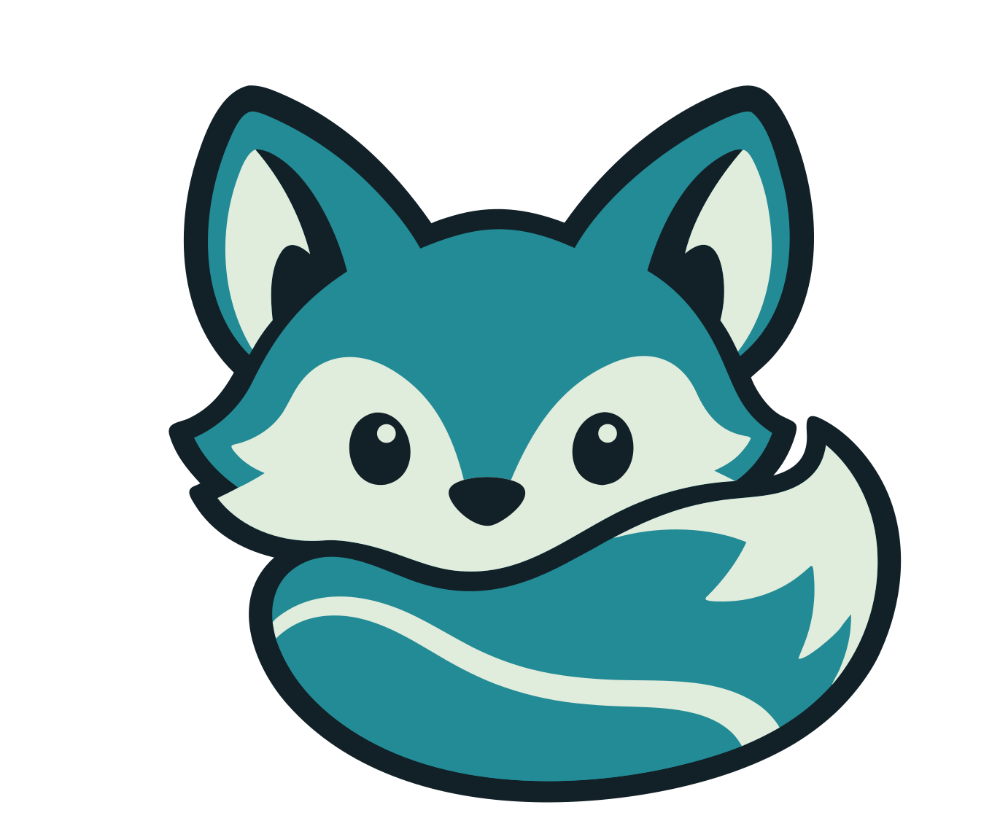

<div align="center">
  

  # VKDG

  **Route your AI tools through one endpoint on your own server.**

  Claude Code, Codex, Kiro, Cursor — one URL, your infrastructure, your keys.

  [](./LICENSE)
  [](#)
  [](https://rust-lang.org)

  [Docs](#documentation) · [Quick start](#quick-start) · [Providers](#providers) · [Roadmap](./ROADMAP.md) · [Contributing](#contributing)
</div>

---


---

VKDG is a self-hosted AI gateway. It sits between your AI tools and the upstream providers (Anthropic, OpenAI, Groq, etc.), handles routing and fallback, manages your keys in one place, and gives you a web console to see what's happening.

One 13MB binary. No Node, no Python, no Docker required. Run it on a $4/month VPS.

## Quick start

```bash
# macOS / Linux — download the latest release
curl -fsSL https://get.vkdg.dev/install.sh | sh

# Or build from source
git clone https://github.com/vkdprojects/vkdg
cd vkdg && just build
```

Start it:

```bash
export ANTHROPIC_API_KEY=sk-ant-...
vkdg serve
```

```
  ╔══════════════════════════════════════════════════════╗
  ║   ▶  VKDG  v0.1.0                                   ║
  ╠══════════════════════════════════════════════════════╣
  ║   Gateway   http://localhost:8080                    ║
  ║   Console   http://localhost:9090                    ║
  ╠══════════════════════════════════════════════════════╣
  ║   Bootstrap token (use once to sign in):            ║
  ║   a4f7c2b1-...                                      ║
  ╚══════════════════════════════════════════════════════╝
```

Open `http://localhost:9090`, paste the token, done. Point Claude Code at `http://localhost:8080`.

```bash
# Claude Code
claude config set ANTHROPIC_BASE_URL http://localhost:8080

# OpenAI SDK / Codex
OPENAI_BASE_URL=http://localhost:8080 codex "..."
```

## What it actually does

You connect one or more provider accounts (API keys, or OAuth for code agents). VKDG routes requests to them based on rules you define — or nothing, if you just want a single passthrough. You see every request in the console, with the routing decision and timing.

The useful parts:

**Routing strategies** — round-robin, weighted split, fallback chain, lowest latency, fusion (parallel fan-out), prompt chain, auto (9-factor scoring). You define a "combo" that maps a model name to a strategy and a list of connections.

**Compression** — RTK compresses tool outputs (git status, test results, build logs) before they hit the context window. Caveman strips obvious whitespace. Together they save 15–95% on tool-heavy agents. Pluggable if you want to add your own rules.

**OAuth code agents** — Claude Code, Codex, Kiro/Amazon Q, GitHub Copilot, Kimi, Antigravity don't use API keys — they use OAuth flows. VKDG handles the auth and token refresh so you connect once and it stays connected.

**Streaming done right** — VKDG injects an error event if an upstream closes the connection mid-stream before `[DONE]`. Your client can detect the incomplete response instead of silently getting half an answer.

**Provider plugins** — providers are Rust crates in `plugins/providers/`. Adding one doesn't touch the core. WIT/WASM interface for languages other than Rust (Phase 3).

## Providers

Built in:

| API key | OAuth / device code |
|---------|---------------------|
| Anthropic | Claude Code |
| OpenAI | OpenAI Codex |
| Google Gemini | Kiro / Amazon Q |
| Groq | Kimi Coding |
| DeepSeek | GitHub Copilot |
| Mistral | Antigravity (Google Cloud Code) |
| Together AI | |
| Fireworks AI | |

Any OpenAI-compatible endpoint also works as a connection — Ollama, vLLM, LM Studio, custom deployments.

## Configuration

VKDG reads a YAML file if you pass one. Without it, it picks up `ANTHROPIC_API_KEY` from the environment and creates a passthrough connection.

```yaml
# vkdg.yaml
listen: "0.0.0.0:8080"

connections:
  - id: anthropic-main
    provider: anthropic
    auth: { type: api_key, env_var: ANTHROPIC_API_KEY }
    models: ["claude-*"]
    max_concurrent: 50

  - id: groq-fast
    provider: groq
    auth: { type: api_key, env_var: GROQ_API_KEY }
    models: ["llama-*"]
    max_concurrent: 30

routes:
  - id: claude-route
    match_models: ["claude-*"]
    strategy: fallback_chain
    targets: [anthropic-main, groq-fast]  # falls back to Groq if Anthropic is down
```

Full config reference: [`config.example.yaml`](./config.example.yaml)

## Deploying on a VPS

VKDG is a single binary. Copy it to your server, set your API keys, start it. If you want custom domains and TLS, put Caddy in front — it handles certs automatically.

```bash
# On your VPS
wget https://github.com/vkdprojects/vkdg/releases/latest/download/vkdg-linux-amd64
chmod +x vkdg-linux-amd64
mv vkdg-linux-amd64 /usr/local/bin/vkdg

# Install as a systemd service
vkdg install --config /etc/vkdg/config.yaml
```

With Caddy for `api.example.com`:

```caddyfile
api.example.com {
  reverse_proxy localhost:8080 {
    flush_interval -1  # required for streaming
  }
}
console.example.com {
  reverse_proxy localhost:9090
}
```

Full guides: [Caddy](./docs/deploy/caddy.md) · [Traefik](./docs/deploy/traefik.md) · [nginx](./docs/deploy/nginx.md)

## Why not OmniRoute / LiteLLM?

OmniRoute is a Next.js app — runs on Node, requires npm, ships with a browser-based dashboard that assumes cloud hosting. It's great at what it does.

VKDG is a Rust binary that fits in 13MB, runs without a runtime, and is designed for self-hosted infrastructure first. The tradeoff is that OmniRoute has a much larger provider catalog and more routing strategies today. We're working on that.

LiteLLM is Python — good for scripting and experimentation, less great as a persistent service.

## Documentation

- [Quick start guide](./docs/sdk/config-reference.md) — config options, routes, combos
- [Adding a provider](./docs/sdk/adding-a-provider.md) — three paths: config-only, WASM plugin, or PR
- [Deploy with Caddy](./docs/deploy/caddy.md) — custom domain + automatic TLS
- [Deploy with Traefik](./docs/deploy/traefik.md) — docker-native
- [Deploy with nginx](./docs/deploy/nginx.md) — streaming-safe config
- [Roadmap](./ROADMAP.md) — where this is going

## Contributing

VKDG is in active development. The codebase is ~22 Rust crates + a SvelteKit console.

```bash
git clone https://github.com/vkdprojects/vkdg
cd vkdg
just dev  # starts the gateway + opens console at localhost:9090
```

See [AGENTS.md](./AGENTS.md) for the architecture overview and crate map. For the console, see [apps/console/CONTRIBUTING-i18n.md](./apps/console/CONTRIBUTING-i18n.md) for translation contributions.

All pull requests welcome. If something is broken or confusing, open an issue.

## License

MIT. See [LICENSE](./LICENSE).

---

<div align="center">
  Built with Rust + SvelteKit. No VC funding, no cloud dependency, no lock-in.
</div>
