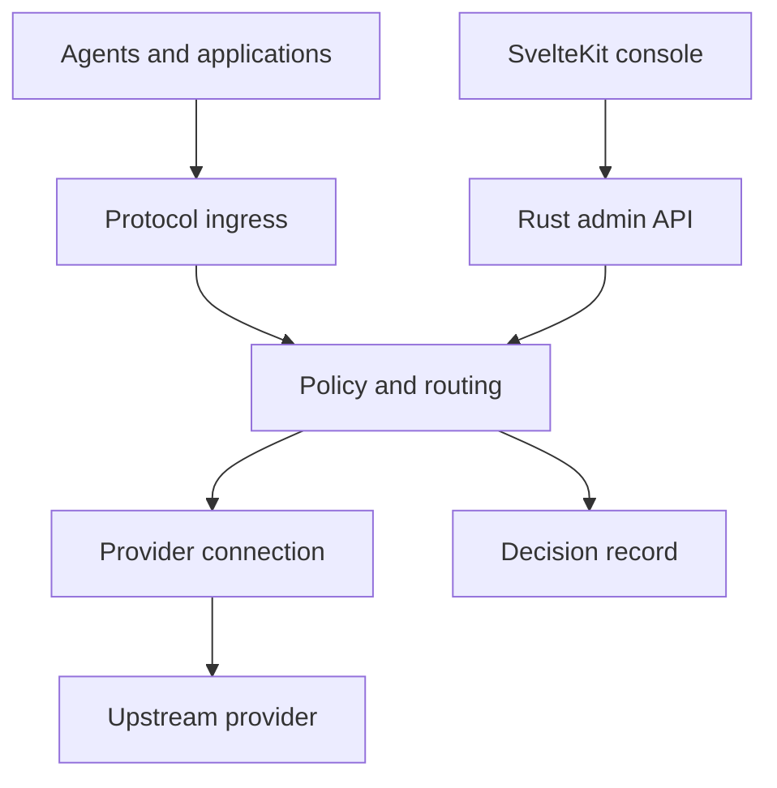

# VKDG

**One endpoint for agents and applications. A real contract behind every route.**

VKDG is an AI gateway for clients that speak different protocols and providers that behave differently. It receives a request, identifies the client, checks what the request needs, selects an eligible provider connection, translates only when the semantics can be preserved, and records why it made that choice.

> **Status:** Phase D + parity sprint complete: 247 tests passing, 0 failing, 0 clippy warnings. 21 crates in production. Phase E (scale/release) in progress.

[The idea](#the-idea) · [How it works](#how-it-works) · [Quick start](#quick-start) · [Endpoints](#endpoints) · [Protocols](#protocols-and-capabilities) · [Phases](#phases) · [Known gaps](#known-gaps) · [Development](#development) · [Architecture](VKDG-architecture-v0.md)

## The idea

Point Claude Code, another agent, or your own application at one address. Give each client its own VKDG credential. Connect the upstream accounts and providers you are allowed to use. VKDG handles the route between them.

This sounds simple until a client sends a tool call that one provider cannot represent, two agents use the same OAuth account concurrently, or an upstream stream fails after bytes have already reached the client. VKDG is designed around those cases.

| At the boundary | VKDG's responsibility |
| --- | --- |
| Different client APIs | Decode the incoming protocol and return a response in that same protocol. |
| Multiple providers and accounts | Choose an eligible **connection**, considering capability, quota, cooldown, policy, and session affinity. |
| Streaming | Preserve event meaning, propagate cancellation and backpressure, and never splice a second provider into a committed response. |
| OAuth credentials | Keep upstream tokens in the gateway, refresh once per connection under concurrency, and issue separate client credentials. |
| Failures | Report an unsupported capability before sending the request; explain routing, fallback, and errors with a request ID. |
| Operations | Manage connections, keys, routes, and diagnostics from the console or the same versioned admin API. |

VKDG does not execute an agent's tools, own its workspace, or store its conversation by default. Sharing an upstream OAuth account does not increase that account's quota or override provider rules.

## How it works



The Rust gateway owns identity, admission, routing, transport, credentials, stream lifecycle, and observability. The SvelteKit console talks to its administrative API through a server-side layer. It can restart without interrupting agent traffic. Configuration changes are validated and activated as an immutable revision so an in-flight request keeps the version it started with.

The important unit of routing is a **provider connection**: a particular provider account with its own credentials, limits, health, and model capabilities. A 429 on one connection should not take down every account on that provider. A session may prefer the same connection across turns, but that preference never bypasses eligibility or authorization.

## Quick start

```bash
# Build
cargo build --release -p vkdg

# Validate config before starting
./target/release/vkdg config check --config vkdg.toml

# Run with a config file
./target/release/vkdg serve --config vkdg.toml

# Run with env vars (no config file)
ANTHROPIC_API_KEY=sk-ant-... ./target/release/vkdg serve
```

Minimal `vkdg.toml`:

```toml
[server]
port = 4000

[[connections]]
id = "anthropic-default"
provider = "anthropic"
models = ["claude-opus-4-5", "claude-sonnet-4-5"]

[[routes]]
pattern = "*"
connection = "anthropic-default"
```

Send a request using the Anthropic wire protocol:

```bash
curl http://localhost:4000/v1/messages \
  -H "Content-Type: application/json" \
  -H "x-api-key: <your-vkdg-client-key>" \
  -d '{
    "model": "claude-opus-4-5",
    "max_tokens": 256,
    "messages": [{"role": "user", "content": "Hello"}]
  }'
```

Or the OpenAI wire protocol:

```bash
curl http://localhost:4000/v1/chat/completions \
  -H "Content-Type: application/json" \
  -H "Authorization: Bearer <your-vkdg-client-key>" \
  -d '{
    "model": "claude-opus-4-5",
    "messages": [{"role": "user", "content": "Hello"}]
  }'
```

## Endpoints

| Method | Path | Protocol | Description |
| --- | --- | --- | --- |
| `POST` | `/v1/messages` | Anthropic Messages | Conversation generation; streaming supported |
| `POST` | `/v1/chat/completions` | OpenAI Chat Completions | Conversation generation; streaming supported |
| `POST` | `/v1/images/generations` | OpenAI Images | Image generation |
| `GET` | `/health` | — | Health check; returns 200 when ready |
| `GET` | `/vkdg/v1/info` | — | Gateway version and build info |
| `GET` | `/mcp` | MCP | Tool discovery (route_preview, gateway_health) |

## Protocols and capabilities

Compatibility is declared per **client protocol × provider adapter × capability**. A working text response is not evidence that tool calls, reasoning blocks, images, usage, or streaming work on the same route. If a required feature cannot survive translation, that connection is excluded or the request fails with an explicit incompatibility error.

| Surface | Status |
| --- | --- |
| Anthropic Messages (`/v1/messages`) | ✅ Implemented: text, streaming, tool calls |
| OpenAI Chat Completions (`/v1/chat/completions`) | ✅ Implemented: text, streaming, parallel tool calls |
| OpenAI Images (`/v1/images/generations`) | ✅ Implemented |
| Video generation (`/v1/videos/generations`) | ✅ 202 Accepted + async job; polling pending |
| VKDG native API | Designed; not yet exposed |
| Admin API (`/admin/v1/`) | Pending: see [Known gaps](#known-gaps) |

## Phases

| Phase | Description | Status |
| --- | --- | --- |
| A | Executable specification: types, state machine, 13 contract scenarios | ✅ Complete |
| B | Data vertical: HTTP server, pipeline, SSE parser, Anthropic ingress/provider | ✅ Complete |
| C | Interoperability: OpenAI ingress/provider, 429 fallback, bidirectional translation | ✅ Complete |
| D | Modalities and extensions: config hot-reload, jobs, artifacts, WASM plugin host, compression, circuit breaker | ✅ Complete |
| E | Scale/release: benchmarks, full OAuth, Admin API, SvelteKit console | 🔄 In progress |

## Known gaps

These are honest stubs that will be completed in Phase E. Nothing here is hidden or silently broken: each is tested as returning a safe placeholder.

- **WASM `call_prepare`** is a stub. The Component Model bindgen is not yet wired; plugins load and unload but cannot intercept requests.
- **`ModelSummarize` compression** is a stub. Context truncation runs but the summarize path requires an internal metered call.
- **`video.generate` polling/webhook** not implemented. The endpoint returns 202 Accepted with a job ID; status polling and webhook delivery are Phase E.
- **OAuth2 credential refresh** is a stub. Static API keys work; singleflight refresh + encrypted vault is Phase E.
- **Admin API** (`/admin/v1/`) is pending. Connection, route, and key management requires the SvelteKit console work: see [VKDG-frontend-day0.md](VKDG-frontend-day0.md).
- **`vkdg request explain <id>`** fetches and displays the `DecisionRecord` from the admin API.
- **`vkdg config explain --model <name>`** simulates routing for a model without consuming quota.
- **`vkdg replay <fixture>`** sends a recorded request to the gateway and optionally asserts the response.

## Development

Changes to behavior start with a test that fails for the intended reason. A good test names the defect it would catch, asserts an observable result, and uses an expectation independent of the implementation.

```bash
# Run all tests
cargo test --workspace

# Run with clippy
cargo clippy --workspace -- -D warnings

# Check config file
./target/release/vkdg config check --config vkdg.toml
```

Current baseline: **247 tests, 0 failing, 0 clippy warnings** across 21 crates.

| Document | Read it for |
| --- | --- |
| [Architecture](VKDG-architecture-v0.md) | Product scope, protocol boundaries, routing, storage, plugins, and milestones. |
| [Console architecture](VKDG-frontend-day0.md) | Separate SvelteKit process, admin API, security, and first operator journey. |
| [Agent guide](AGENTS.md) | The order to inspect contracts and change code. |
| [Changelog](CHANGELOG.md) | Per-phase change history and known gaps. |
| [SDK docs](docs/sdk/) | Adding a provider, writing a plugin, config reference. |
| [ADRs](docs/adr/) | Architecture decision records. |
| [Test-first skill](.agents/skills/vkdg-test-first/SKILL.md) | RED, GREEN, refactor, edge cases, and evidence for each change. |

## The console

VKDG is designed as two services: the Rust gateway and a **SvelteKit operator console**. The console is part of the first usable product, with its own process and deployment lifecycle. The gateway remains usable if the web process is down.

The first operator journey is deliberately complete: set up an administrator, connect a provider account, create a scoped client key, configure a route, send a real request, and inspect the decision that handled it.

See the [console architecture](VKDG-frontend-day0.md) for the API boundary, OAuth callback flow, session model, deployment, and test scenarios.

## Extensions without a hidden second gateway

Provider adapters describe capabilities, request preparation, event decoding, and error classification. The core retains control of HTTP, credentials, resource budgets, and cancellation. Official adapters start as Rust crates; the WASM plugin interface is implemented and tested: external providers can be loaded at runtime after Phase E completes the Component Model bindgen.

See [docs/sdk/adding-a-provider.md](docs/sdk/adding-a-provider.md) and [docs/sdk/writing-a-plugin.md](docs/sdk/writing-a-plugin.md).

## Project boundaries

VKDG is an API gateway and control surface, not an agent runtime. It does not run a client's tools or manage its files. Its native API offers a common entrypoint and capability discovery, not a promise that every provider feature can be represented without loss. Compression and route composition are policy mechanisms that must preserve required semantics and be measured before they become defaults.

The goal is a gateway you can reason about when a request succeeds, and one you can debug when it does not.
