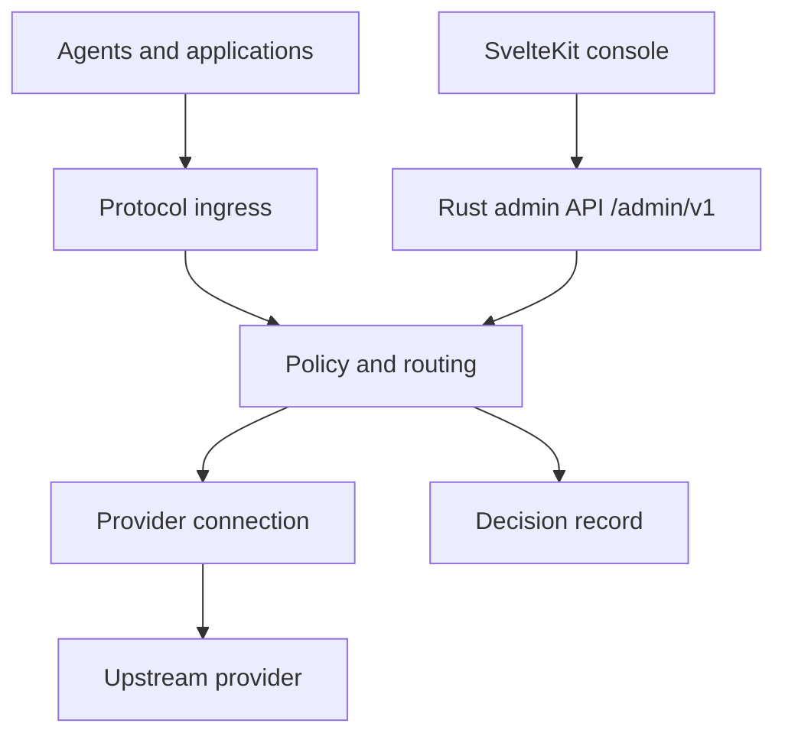

# VKDG

**One endpoint for agents and applications. A real contract behind every route.**

VKDG is an AI gateway in Rust. It receives requests from Claude Code, Codex, and OpenAI-compatible clients, routes them to one of multiple upstream provider accounts, and streams responses back. Every routing decision is recorded with its reasons.

> **Status:** Phase D complete + parity sprint. 247 tests, 0 failing, 0 clippy warnings. 22 crates. Phase E (OAuth2 PKCE, WASM bindgen, scale) in progress.

[The idea](#the-idea) · [How it works](#how-it-works) · [Quick start](#quick-start) · [Endpoints](#endpoints) · [Protocols](#protocols-and-capabilities) · [Plugin system](#plugin-system) · [Phases](#phases) · [Known gaps](#known-gaps) · [Development](#development) · [Architecture](VKDG-architecture-v0.md)

---

## The idea

Point Claude Code, another agent, or your own application at one address. Give each client its own VKDG credential. Connect the upstream accounts and providers you are allowed to use. VKDG handles the route between them.

This sounds simple until a client sends a tool call that one provider cannot represent, two agents use the same OAuth account concurrently, or an upstream stream fails after bytes have already reached the client. VKDG is designed around those cases.

| At the boundary | VKDG's responsibility |
| --- | --- |
| Different client protocols | Decode the incoming wire format and return a response in that same format. |
| Multiple provider accounts | Choose an eligible connection, considering capability, quota, cooldown, policy, and session affinity. |
| Streaming | Preserve event semantics, propagate backpressure, and never splice a second provider into a committed response. |
| OAuth credentials | Keep upstream tokens in the gateway, refresh once per connection under concurrency, and issue separate client credentials. |
| Failures | Report an unsupported capability before sending the request; explain routing, fallback, and errors with a request ID. |
| Operations | Manage connections, keys, routes, and diagnostics from the admin console or the same versioned admin API. |

VKDG does not execute an agent's tools, own its workspace, or store its conversation by default. Sharing an upstream OAuth account does not increase that account's quota or override provider rules.

---

## How it works



The Rust gateway owns identity, admission, routing, transport, credentials, stream lifecycle, and observability. The SvelteKit console talks to its administrative API through a server-side BFF layer. The gateway remains operational if the console process is down. Configuration changes are validated, then activated as an immutable revision — an in-flight request keeps the snapshot it started with.

The key routing unit is a **provider connection**: a particular provider account with its own credentials, limits, health, and model capabilities. A 429 on one connection does not take down other accounts on that provider.

---

## Quick start

```bash
cargo build --release -p vkdg

# Start with a config file
./target/release/vkdg serve --config vkdg.toml

# Or with an environment variable (no config file needed)
ANTHROPIC_API_KEY=sk-ant-... ./target/release/vkdg serve

# Validate config before starting
./target/release/vkdg config check --config vkdg.toml
```

Minimal `vkdg.toml` (see [docs/sdk/config-reference.md](docs/sdk/config-reference.md) for all options):

```toml
listen = "0.0.0.0:8080"

[[connections]]
id = "anthropic-default"
provider = "anthropic"
models = ["claude-*"]
max_concurrent = 100

  [connections.auth]
  type = "api_key"
  env_var = "ANTHROPIC_API_KEY"

[[routes]]
id = "default"
match_models = ["claude-*"]
strategy = "round_robin"
targets = ["anthropic-default"]
```

Send a request using the Anthropic wire protocol:

```bash
curl http://localhost:8080/v1/messages \
  -H "Content-Type: application/json" \
  -d '{
    "model": "claude-3-5-haiku-20241022",
    "max_tokens": 256,
    "messages": [{"role": "user", "content": "Hello"}]
  }'
```

Or the OpenAI wire protocol:

```bash
curl http://localhost:8080/v1/chat/completions \
  -H "Content-Type: application/json" \
  -d '{
    "model": "claude-3-5-haiku-20241022",
    "messages": [{"role": "user", "content": "Hello"}]
  }'
```

---

## Endpoints

### Data plane (port 8080 by default)

| Method | Path | Protocol | Description |
| --- | --- | --- | --- |
| `POST` | `/v1/messages` | Anthropic Messages | Conversation generation; streaming supported |
| `POST` | `/v1/chat/completions` | OpenAI Chat Completions | Conversation generation; streaming supported |
| `POST` | `/v1/images/generations` | OpenAI Images | Image generation |
| `GET` | `/health` | — | Returns `{"status":"ok"}` when ready |
| `GET` | `/vkdg/v1/info` | — | Gateway version |
| `GET` | `/mcp` | MCP | Tool discovery |

### Admin plane (port 9090 by default, `VKDG_ADMIN_ADDR`)

| Method | Path | Description |
| --- | --- | --- |
| `GET` | `/admin/v1/system` | Version, health, active config revision (no auth required) |
| `POST` | `/admin/v1/session` | Exchange bootstrap token for a session cookie |
| `DELETE` | `/admin/v1/session` | Revoke session |
| `GET` | `/admin/v1/session/me` | Current session identity |
| `GET` | `/admin/v1/connections` | List configured connections |
| `GET` | `/admin/v1/connections/{id}` | Single connection status |
| `GET/POST` | `/admin/v1/keys` | List / create client keys |
| `DELETE` | `/admin/v1/keys/{id}` | Revoke a key |
| `GET` | `/admin/v1/routes` | Active routing rules |
| `GET` | `/admin/v1/routes/preview?model=` | Simulate routing without consuming quota |
| `GET` | `/admin/v1/requests` | Recent requests, paginated |
| `GET` | `/admin/v1/requests/{id}` | Single request with DecisionRecord |

---

## Protocols and capabilities

Compatibility is declared per client protocol × provider adapter × capability. A working text response is not evidence that tool calls, images, or streaming work on the same route. If a required feature cannot survive translation, that connection is excluded or the request fails with an explicit error.

| Surface | Status |
| --- | --- |
| Anthropic Messages (`/v1/messages`) | Implemented: text, streaming, tool calls, image blocks, think-tag filtering |
| OpenAI Chat Completions (`/v1/chat/completions`) | Implemented: text, streaming, parallel tool calls |
| OpenAI Images (`/v1/images/generations`) | Implemented |
| Video generation (`/v1/videos/generations`) | 202 Accepted + async job; polling and webhook pending |
| VKDG native API | Designed; not yet exposed as HTTP endpoints |

---

## Plugin system

Everything extensible is a plugin. Providers, routing strategies, compressors, cache backends, and auth handlers all implement the same WIT interfaces defined in `wit/`. The gateway owns HTTP, credentials, stream lifecycle, and observability. Plugins translate data.

**Built-in compressors:** `truncate`, `caveman` (regex filler removal, ~30% savings), `rtk` (tool-output class detection, 60-90%), `stacked` (RTK then Caveman, 78-95%).

**Routing mode packs:** `ship-fast`, `cost-saver`, `quality-first`, `offline-friendly`, `balanced`. Set per request with `X-VKDG-Mode` or per combo in config.

**Override headers:**
- `X-VKDG-Mode: ship-fast` — mode pack for this request
- `X-VKDG-Compression: none` — skip compression
- `X-VKDG-Cache: none` — bypass cache
- `X-VKDG-Think-Tags: include` — preserve `<think>` blocks from reasoning models

See [docs/sdk/writing-a-plugin.md](docs/sdk/writing-a-plugin.md) and [docs/sdk/adding-a-provider.md](docs/sdk/adding-a-provider.md).

---

## Phases

| Phase | Description | Status |
| --- | --- | --- |
| A | Executable spec: types, state machine, 13 contract scenarios | Complete |
| B | Data vertical: HTTP server, pipeline, SSE parser, Anthropic ingress/provider | Complete |
| C | Interoperability: OpenAI ingress/provider, 429 fallback, bidirectional translation | Complete |
| D | Modalities and extensions: config hot-reload, jobs, artifacts, WASM plugin host, compression, scoring, combos, memory, eval, admin API, console | Complete |
| E | Scale/release: OAuth2 PKCE, WASM bindgen, benchmark suite, production hardening | In progress |

---

## Known gaps

Honest stubs that will be completed in Phase E. None silently breaks; each returns a safe, documented placeholder.

- **WASM `call_prepare`** — plugins load, validate, and install. The Component Model bindgen call is stubbed; plugins cannot intercept requests until Phase E wires it.
- **OAuth2 auth_code + PKCE** — the `client_credentials` M2M flow is implemented. Auth code + PKCE for Anthropic/OpenAI user accounts is Phase E.
- **`video.generate` polling/webhook** — returns 202 Accepted with a job ID. Status polling and webhook delivery are Phase E.
- **`ModelSummarize` compression** — context truncation and Caveman/RTK run. The LLM summarize path requires an internal metered call; placeholder returns `StrategyUnavailable`.
- **SvelteKit console screens** — login, overview, connections, keys, routes, and requests are implemented. E2E browser flow tests are pending.

---

## Development

Changes to behavior start with a failing test. A good test names the defect it would catch, asserts an observable result, and uses an expectation independent of the implementation.

```bash
# Full test suite
cargo test --workspace --tests

# Clippy with CI-equivalent flags
cargo clippy --workspace --all-targets --locked -- -D warnings

# Unused dependency check
cargo machete

# Spell check
typos .
```

Current baseline: **247 tests, 0 failing, 0 clippy warnings** across 22 crates.

### Git hooks

```bash
brew install lefthook && lefthook install
```

Pre-commit: typos + rustfmt on staged files.
Pre-push: clippy `--all-targets -D warnings` + cargo-machete.

### Documents

| Document | What it covers |
| --- | --- |
| [AGENTS.md](AGENTS.md) | Commands, crate map, module structure, invariants — start here for any code change |
| [Architecture](VKDG-architecture-v0.md) | Product scope, protocols, routing, storage, plugins, phase milestones |
| [Console architecture](VKDG-frontend-day0.md) | SvelteKit process, admin API contract, security model, operator journey |
| [CHANGELOG](CHANGELOG.md) | Per-phase change history |
| [Config reference](docs/sdk/config-reference.md) | Full `vkdg.toml` schema |
| [Adding a provider](docs/sdk/adding-a-provider.md) | Step-by-step guide |
| [Writing a plugin](docs/sdk/writing-a-plugin.md) | WIT interface and lifecycle |
| [ADRs](docs/adr/) | Architecture decision records |
| [Release blockers audit](docs/release/RELEASE-BLOCKERS-AUDIT.md) | Security and correctness verification |

---

## The console

VKDG runs as two services: the Rust gateway and a SvelteKit operator console. The console is part of the first usable product — its own process, its own deployment. The gateway stays up if the console goes down.

The operator journey is complete: set up an administrator, connect a provider account, create a scoped client key, configure a route, send a real inference request, and inspect the decision that handled it.

See [VKDG-frontend-day0.md](VKDG-frontend-day0.md) for the API boundary, OAuth flow, session model, and deployment.

---

## Project boundaries

VKDG is an API gateway. It does not run an agent's tools or manage files. Its native API offers a common entry point and capability discovery, not a promise that every provider feature can be represented without loss. Compression and route composition are policy mechanisms that must preserve required semantics and be measured before they become defaults.

The goal is a gateway you can reason about when a request succeeds, and one you can debug when it does not.
