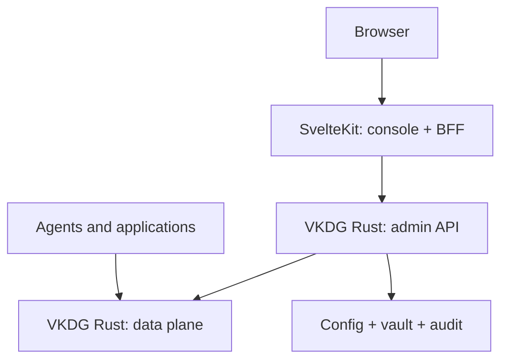

# VKDG Console — SvelteKit frontend as an independent process

**Architecture decision, 25/09/2026.** This document complements `VKDG-architecture-v0.md`. The operations console is part of day 0. SvelteKit on Node (`adapter-node`) is a process, build, and deploy separate from the Rust server. The experience must allow operating the gateway for real, not just displaying metrics. Parity with OmniRoute is a utility reference, not a promise of all screens and features in the first delivery.

## 1. Boundaries and topology



The Rust binary exposes two distinct surfaces: the public **data API** for inference and the private, versioned **admin API** for management. They may share the Rust process initially, but use distinct listeners/routes, identity, rate limits, and permissions; admin does not inherit the public exposure of the data API. An edge proxy can serve `console.example` for SvelteKit and `api.example` for clients, without forwarding `/admin` to the Internet. On a laptop, defaults to `127.0.0.1` on different ports and internal communication. In remote deployment, internal network/TLS between services and explicit console exposure with authentication.

SvelteKit is the BFF: `+page.server.ts` loads views and form actions perform mutations; `src/lib/server/vkdg/` contains a typed HTTP client for the admin API. The browser speaks with the web process through its own origin; it does not receive the admin key, OAuth refresh token, or internal URL. SvelteKit does not access SQLite, vault, configuration files, or router state. Rust continues serving traffic if the console goes down, and a slow console does not block streams. SvelteKit can be updated and scaled without restarting the core. The console must show backend unavailability/reconnection with a clear error, without pretending a mutation was applied.

### Repository and processes

```text
crates/                      # core, admin API, storage Rust
apps/console/                # SvelteKit + TypeScript + adapter-node
  src/lib/server/vkdg/       # typed admin HTTP and error mapping
  src/lib/components/        # presentation components without admin calls
  src/lib/features/          # domain units: connections, routes, traces...
  src/routes/                # thin composition, loads and actions
contracts/admin/             # versioned OpenAPI, examples, and sanitized fixtures
deploy/                      # independent gateway service and console service
```

A monorepo with two toolchains and pipelines: `cargo ...` for Rust; fixed Node package manager and `svelte-check`, lint, build, and console tests in the app. CI generates/verifies the typed client against frozen OpenAPI, rejects drift, and tests compatibility between web version and core version. No direct import of internal Rust types into the UI, nor schema generation from code that does not represent the wire API.

## 2. Who owns what

| Domain | Owner | Contract with the console |
| --- | --- | --- |
| Client credentials and admin users | Rust | Opaque web session, profiles/permissions, and revocation |
| Connections and upstream OAuth | Rust | Initiate flow, get status, test, disable, remove; secret never returned |
| Configuration, routes, combos, policies, plugins | Rust | Read revision, validate proposal, apply with expected revision, audit/rollback |
| Requests, decisions, usage, quotas, and jobs | Rust | Paginated/filtered queries and summarized events without sensitive payload |
| Pages, forms, navigation, and visual state | SvelteKit | Render and call admin API; no operational database of its own |
| SDKs and agent clients | Rust/data API | Same endpoint regardless of console up/down |

**Config as single source of truth:** the versioned file remains canonical on the single instance. A UI change sends a semantic patch/command to Rust with `expected_revision`; Rust builds a candidate, validates references and plugins, writes the file atomically, swaps the snapshot, and records audit. CLI uses the same mechanism. An external file change triggers a validated import/reload and a new revision; conflict returns `409 revision_conflict`, never silently overwrites. Secrets have write-only operations in the vault, separate from the exportable file. In a cluster, the same API swaps the configuration repository implementation without changing the web contract; inter-replica coordination is required before enabling distributed editing.

## 3. Security and operational onboarding

First Rust boot generates initial configuration state and indicates in the terminal/CLI a local operator bootstrap procedure (short single-use token or authenticated local command). The token is exchanged once for administrative credentials and invalidated; there is no default password or secret in the frontend build. Rust maintains revocable sessions and RBAC, with `viewer`, `operator`, and `admin` as initial capabilities to specify per action; validation always occurs in Rust, including reads. Inference client keys do not give access to admin. For remote mode, TLS, rate limiting, and session rotation/revocation go into the first secure deployment.

Login via SvelteKit action calls the admin API and stores an opaque session identifier in an `HttpOnly`, `Secure` on HTTPS, `SameSite=Lax` or `Strict` cookie, scoped to the console origin; logout revokes the session in Rust and clears the cookie. SvelteKit hooks can load identity into `locals`, but each Rust operation re-validates session and permission. Do not store admin session in a global Node store nor pass the session in HTML, URL, console/log, or `localStorage`. CSRF/correct origin on mutations; `ORIGIN` configured in `adapter-node` behind the trusted reverse proxy. Actions with input validation and explicit method/path allowlist; do not implement a generic proxy controlled by browser URL. CSP and escaped content for provider/diagnostic data.

Upstream OAuth: the console requests `POST /admin/v1/connections/oauth/start`, which produces an authorization URL with `state`, PKCE, and expiration created in Rust. The provider callback ends at the callback endpoint controlled by Rust (published only for the required OAuth flow); Rust validates state, binds to the session/tenant, and saves the token in the vault. Redirects to a secure console route only with public status/ID, without code/token; `return_to` is strictly allowlisted. For flows that require local loopback or device code, expose instructions/status and polling in the console without moving secrets to JS. Test each provider's quirks before enabling its button.

## 4. Minimum administrative API

Initial contract in `contracts/admin/openapi.yaml`, version `/admin/v1`, with errors `{code, message, request_id, details?}` without secret material. `ETag`/`revision` and `If-Match` or `expected_revision` protect mutations. Cursor for histories, maximum page limit, server-side filters, documented fields and cardinality. Do not return prompts/responses by default. The debug query returns `DecisionRecord` and authorized steps without sensitive headers.

| Group | First contract | Why |
| --- | --- | --- |
| `session`, `me` | bootstrap/login/logout/me, permissions | usable and secure console |
| `system` | version, health, active configuration, capabilities | know what is running |
| `connections` | list, create key/OAuth, status, test, disable | operator's first real operation |
| `models`, `routes` | real catalog, rules, and eligibility preview | avoid an invalid route |
| `config` | read revision, validate, apply, history, rollback | atomic and reversible changes |
| `keys` | create, scope, revoke, reveal only at creation | connect clients without lending OAuth |
| `requests`, `usage` | filtered listing, decision, latency, usage | debug without recording conversation |

The routing preview uses the same eligibility function from the core, with synthetic/authorized input and without consuming quota or reserving an account. The config validation payload explains errors by path/field. The UI never calculates capabilities, final cost, or availability by its own rule. The cost contract distinguishes measured, estimated, and unknown value; do not invent price or quota when upstream does not provide it.

## 5. Day 0 pages and expansion

| Moment | Useful screen | Verifiable delivery |
| --- | --- | --- |
| First cut | Setup/login, overview, and endpoint | bring up two services, log in, see backend/version, copy secure endpoint |
| First connection | Providers/connections | connect an account, identify capability, error, and OAuth status without exposing secret |
| First client | Keys + Claude Code guide | issue a scoped key, configure local CLI, confirm a real request |
| First policy | Models/routes/simple combos | preview, validation, atomic change, and conflict between two edits |
| First operation | Requests, health, and usage | find a request by ID, see selection/fallback, cooldown, latency, and error |

To reach OmniRoute's utility: the product documentation shows dashboards for OAuth connections, combos, analytics, health, translator/playground, logs, keys, and audit. These items inform the long-term navigation; day 0 priority is **setup → connection → key → route → first request → debug**. Protocol playground, batch translation test, audio/video, media, themes, advanced audit, and plugin editing go in alongside their corresponding real contracts; do not display operable screens that promise features that do not yet exist. A future playground must enforce quotas/limits, isolate test requests, and share the real inference path. A remote CLI configuration interface can generate commands/files to copy; a web server should not attempt to inject configurations directly into a user's machine.

## 6. Screen updates and costs

SSR/load for initial state. Mutation with form action and progressive enhancement where it makes sense; operational data with revision-based revalidation and moderate polling. Optional live tail via SSE **from the admin API via a dedicated BFF**, with authorization, heartbeat, cursor/reconnection, per-user cap, and filter applied in Rust. Events must be low-cardinality summaries, bounded queue, and explicit loss policy; do not export token/chunk/prompt in each event. Do not keep a live connection open for each dashboard card. Charts use paginated aggregates and configurable windows, avoiding querying raw logs on each render. The console observes trace/request_id in errors without correlating via secret content.

## 7. Deploy and operation

Two independent artifacts: Rust `vkdg-gateway` binary/image and Node `vkdg-console` image generated by `adapter-node`. Console receives private `VKDG_ADMIN_URL` and public `ORIGIN`; gateway receives bind/admin and config/vault paths. Do not compile URL/secret into the client bundle. Separate health/liveness/readiness. Console update does not restart Rust; shutting down console does not shut down gateway. If the admin API is unavailable, console shows unavailability without accidentally losing the session. If console goes down, CLI admin and data API remain operational. Version compatibility has a documented window, `/admin/v1/system` endpoint with version/capabilities, and UI fallback for missing features. Single-node can deploy via Compose with two services; production deployment with separate scaling uses a private network between services.

## 8. Test first for both languages

Follow `.agents/skills/vkdg-test-first/SKILL.md` on each contract and behavioral screen. Rust: RED test of admin API and revision/RBAC/audit invariants. Console: RED test of action/load/BFF exercising HTTP contract with a fake server (status, body, cookie, revision, backend loss); real browser flow test for onboarding and operations that cross authentication/redirection. Versioned wire fixtures cross both suites. Avoid tests that only verify whether a component renders a button name; a test must fail against a plausible bug.

Essential cases: viewer attempts mutation; revoked session; tenant A session tries to read B; inference key attempts admin; invalid/replay/expired OAuth state callback; two tabs change revision and the second receives 409; validation error does not activate snapshot; console restarts during stream and stream completes; gateway restarts and console recovers; external `return_to` is rejected; token never appears in HTML/log/event; slow console does not change data plane p95 under reference load. E2E tests require truly separate processes, without direct console access to the database. Do not create facade tests that only verify mocks.

## 9. Sequence for the agent already implementing

1. Adopt this decision now and replace any "UI later" premise. Do not stop core development: open the first `/admin/v1/system` contract, session, and connection listing in parallel with the corresponding Rust slices.
2. Freeze OpenAPI and fixtures for the first slice **before** the typed client. Implement Rust with RED/GREEN, then SvelteKit BFF and screen with RED/GREEN. Contracts do not exist only to satisfy the UI: the CLI uses them too.
3. Bring up two local processes with a reproducible command; document ports, `ORIGIN`, bootstrap, and shutdown. Show the first complete user path before adding charts or many providers.
4. Measure the data plane with console absent and present; verify that admin queries do not hold prolonged locks or change account reservations. Address observed limits, not presumed optimizations.

## References

- OmniRoute, [official console feature gallery](https://github.com/diegosouzapw/OmniRoute/wiki/Features): connections, combos, analytics, health, translator, keys, logs, and audit. The page indicates its own update scope; validation of each feature is left to implementation.
- SvelteKit, [adapter-node](https://svelte.dev/docs/kit/adapter-node), [authentication](https://svelte.dev/docs/kit/auth), [form actions](https://svelte.dev/docs/kit/form-actions), and [server-only modules](https://svelte.dev/docs/kit/server-only-modules).
