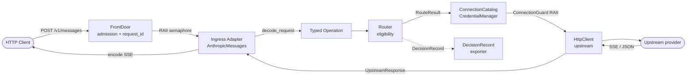

# VKDG — Architectural overview

Summary reference. Full document: [`VKDG-architecture-v0.md`](../../VKDG-architecture-v0.md).

## Data flow

## Crate table

| Crate | Layer | Responsibility |
|---|---|---|
| `vkdg-core` | Domain | IDs, state machine, `DecisionRecord`, `VkdgError`, `CapabilitySet` |
| `vkdg-operations` | Domain | Operation contracts by family; re-exports `Capability`/`CapabilitySet` |
| `vkdg-connections` | Infrastructure | Connection catalog, `CredentialManager`, `ConnectionGuard` |
| `vkdg-routing` | Infrastructure | Routing strategies, eligibility filtering |
| `vkdg-ingress-anthropic` | Ingress adapter | Decode/encode of the Anthropic Messages protocol |
| `vkdg-http` | Server | HTTP server, admission guard, SSE, upstream client, pipeline runner |
| `vkdg-observe` | Observability | tracing init, OTLP, `DecisionRecordExporter` |
| `vkdg-plugin-host` | Extensions | Manifest registry; WASM execution in Phase D |
| `vkdg-storage` | Persistence | `JobStore` port + in-memory implementation |
| `vkdg-cli` | Control | `doctor` and `config check` commands |
| `bin/vkdg` | Binary | Entrypoint, configuration, PipelineState wiring |

## Critical path of a request

1. `FrontDoor` accepts the TCP connection, assigns `request_id`/`trace_id`, applies body limit.
2. `AdmissionGuard` acquires RAII semaphore — releases on any exit (success, error, panic, cancellation).
3. `vkdg-ingress-anthropic::decode_request` validates and converts Anthropic bytes into `(model_name, Operation)`.
4. `PipelineCtx` is created with state `Received`; advances through audited transitions.
5. `Router::resolve` filters connections by eligibility and returns `RouteResult` with `ConnectionGuard`.
6. `CredentialManager` delivers token, with singleflight refresh if expired.
7. `HttpClient::send` forwards to the provider; returns `UpstreamResponse::Streaming` or `Complete`.
8. For streaming: `events_to_sse_stream` serializes `ConversationEvent`s back to the Anthropic client.
9. `DecisionRecordExporter` emits the auditable record outside the response loop.

## What belongs to core vs plugins

**Core** (never delegatable to a plugin):
- Identity (`RequestId`, `ClientId`, `TenantId`)
- Admission and semaphores
- `AttemptState` transitions and `committed` flag
- Credential injection in transport
- `DecisionRecord`

**Plugins** (Phase D):
- Alternative ingress protocols (`ingress`)
- Provider adapters (`provider`)
- Custom routing policies (`policy`)
- Telemetry exporters (`observer`)
- External artifact stores (`artifact-store`)
